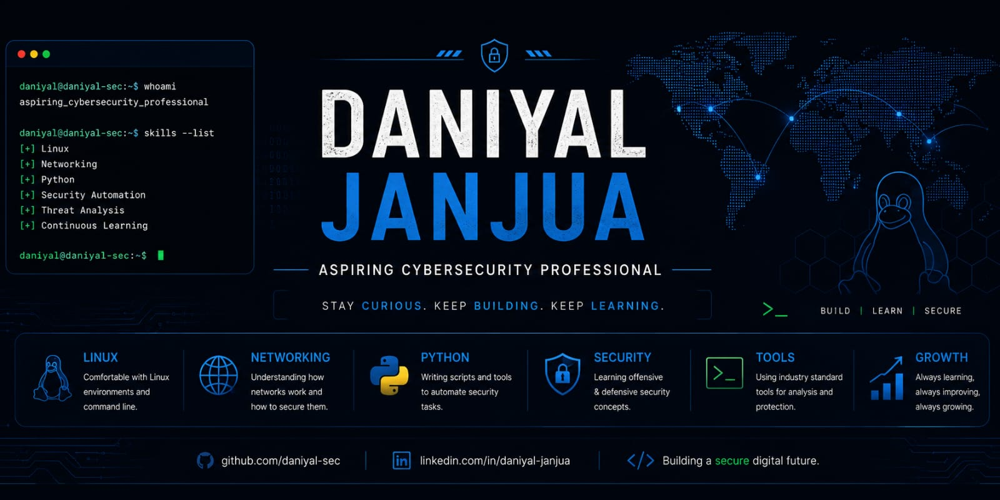

  

 

<h1 align="center">Hi 👋, I'm Daniyal Janjua</h1>

<h3 align="center">
Computer Science Graduate • Aspiring Cybersecurity Professional
</h3>

---

## 👨‍💻 About Me

I'm a **Computer Science graduate** with a strong interest in **Cybersecurity**, **Linux**, and **Network Security**.

My academic background includes full-stack web development, where I built a **Fish Farming Guide** as my Final Year Project using **React.js, Node.js, and MySQL**.

I'm now transitioning into cybersecurity and actively developing practical skills through **security tools, labs, Linux environments, networking exercises, and hands-on projects**.

---

## 🛠️ Featured Cybersecurity Projects

### ⚡ Nexorium Pulse

**Nexorium Pulse** is a lightweight multithreaded **TCP port scanner built in Python** for network reconnaissance in authorized environments.

I built this project from scratch while learning Python networking, socket programming, concurrency, Git, GitHub, and Linux-based security workflows.

#### 🔍 Key Features

- ⚡ Multithreaded TCP scanning with up to 100 workers
- 🎯 Custom port range scanning (`1–65535`)
- 🔎 Open and closed port detection
- 🌐 TCP service lookup
- 📊 Scan statistics and execution time
- 📄 TXT report generation
- 📦 JSON report generation
- ⌨️ Graceful `Ctrl+C` scan cancellation
- 🐧 Tested successfully on Kali Linux
- 🪟 Developed and tested on Windows

**Technologies:** `Python` `Sockets` `Threading` `TCP/IP` `Git` `Kali Linux`

### 🔗 [View Nexorium Pulse →](https://github.com/daniyal-sec/Nexorium-Pulse)

> ⚠️ Developed for educational purposes and authorized security testing only.

---

## 🛡️ Current Focus

- 🐧 Linux & Bash
- 🌐 Computer Networking
- 🐍 Python for Cybersecurity
- 🔐 Cybersecurity Fundamentals
- 🔎 Network Security
- 📂 Git & GitHub

---

## 💻 Development Experience

My previous development experience gives me a programming foundation that I'm now applying to cybersecurity and security automation.

- ⚛️ React.js
- 🟢 Node.js
- 🟨 JavaScript
- 🐍 Python
- 🗄️ MySQL
- 🌿 Git

---

## 🎯 2026 Goals

- ✅ Build practical Python security tools
- 🎯 Strengthen Linux & Bash skills
- 🎯 Complete TryHackMe learning paths
- 🎯 Learn Windows & Active Directory security
- 🎯 Practice Web Application Security
- 🎯 Build a strong cybersecurity portfolio
- 🎯 Develop SOC and security analysis skills
- 🎯 Secure an Entry-Level Cybersecurity / SOC Analyst role

---

## 📚 Currently Learning

- 🐧 Linux Administration
- 🌐 Computer Networking
- 💻 Bash Scripting
- 🐍 Python Security Automation
- 🔎 Network Security
- 📂 Git & GitHub

---

## 🚀 Upcoming Projects & Labs

- 🔹 Python Security Tools
- 🔹 Network Security Tools
- 🔹 Linux & Bash Projects
- 🔹 Nmap Labs
- 🔹 Wireshark Traffic Analysis
- 🔹 TryHackMe Labs & Write-ups
- 🔹 Web Application Security Labs
- 🔹 Windows & Active Directory Labs

---

## 🌱 Interests

- 🛡️ Cybersecurity
- 🐧 Linux
- 🌐 Network Security
- 🔍 Ethical Hacking
- ⚙️ Security Automation
- 🔵 SOC & Security Analysis
- ☁️ Cloud Security

---

## 📫 Connect With Me

- 💼 [LinkedIn](https://www.linkedin.com/in/daniyaljanjua)
- 💻 [GitHub](https://github.com/daniyal-sec)
- ⚡ [Nexorium Pulse](https://github.com/daniyal-sec/Nexorium-Pulse)

---

### 💡 Motto

> **"Stay curious. Keep building. Keep learning."**

⭐ *Thanks for visiting my profile! Feel free to explore my repositories and follow my cybersecurity journey.*

