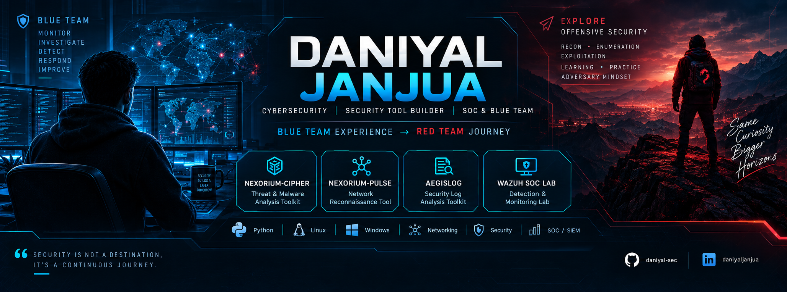

  

 

<h1 align="center">Hi 👋, I'm Daniyal Janjua</h1>

  

  
  
  

  
  
  
  

  <a href="#-about-me">About</a> •
  <a href="#️-featured-cybersecurity-projects">Projects</a> •
  <a href="#-github-activity">Activity</a> •
  <a href="#️-current-focus">Current Focus</a> •
  <a href="#-development-experience">Skills</a> •
  <a href="#-2026-goals">Goals</a> •
  <a href="#-connect-with-me">Connect</a>

## 👨‍💻 About Me

I'm a **Computer Science graduate** building my career around **Cybersecurity, Linux, Network Security, and Security Monitoring**.

My academic background includes full-stack web development, where I built a **Fish Farming Guide** as my Final Year Project using **React.js, Node.js, and MySQL**.

I'm now focused on cybersecurity through **hands-on security tooling, Linux environments, networking, Windows security monitoring, detection engineering, and practical security labs**.

I enjoy learning by building — turning cybersecurity concepts into working tools and real projects.

## 🛡️ Featured Cybersecurity Projects

### 🛡️ AegisLog — Security Monitoring & Threat Detection

**AegisLog** is a cross-platform Python-based **security monitoring and threat detection platform** designed to detect suspicious authentication activity and investigate security findings.

**🎉 AegisLog v1.0.0 is publicly released.**

  

<table>
<tr><td valign="top">

**Detection & Monitoring**
- 🪟 Windows Security Event Log monitoring
- 🐧 Linux systemd journal monitoring
- ⚡ Real-time authentication monitoring
- 🔐 Authentication event detection
- 🚨 Authentication brute-force detection
- 🎯 Password spraying detection
- 🔎 Username enumeration detection
- 🧠 Successful-login-after-multiple-failures correlation

</td><td valign="top">

**Investigation & Platform**
- 🔗 Authentication event correlation
- 📊 Threat severity classification
- 🌐 Source IP classification
- 🚨 Real-time security alerts
- 🔬 Investigation workspace
- 💾 SQLite persistence
- 🖥️ Cross-platform PySide6 GUI
- 🔰 First-time user onboarding

</td></tr>
</table>

**🧪 87 automated tests passing with 0 warnings**

  
  
  
  
  
  
  

### 🔗 [View AegisLog →](https://github.com/daniyal-sec/AegisLog)

> ⚠️ Developed for educational purposes and authorized security monitoring/testing only.

---

### ⚡ Nexorium Pulse

**Nexorium Pulse** is a lightweight multithreaded **TCP port scanner built in Python** for network reconnaissance in authorized environments.

I built this project while learning Python networking, socket programming, concurrency, Git, GitHub, and Linux-based security workflows.

  

<table>
<tr><td valign="top">

**Scanning**
- ⚡ Multithreaded TCP scanning with up to 100 workers
- 🎯 Custom port range scanning (`1–65535`)
- 🔎 Open and closed port detection
- 🌐 TCP service lookup

</td><td valign="top">

**Reporting & Reliability**
- 📊 Scan statistics and execution time
- 📄 TXT report generation
- 📦 JSON report generation
- ⌨️ Graceful `Ctrl+C` scan cancellation
- 🐧 Tested on Kali Linux · 🪟 Developed and tested on Windows

</td></tr>
</table>

  
  
  
  
  
  

### 🔗 [View Nexorium Pulse →](https://github.com/daniyal-sec/Nexorium-Pulse)

> ⚠️ Developed for educational purposes and authorized security testing only.

## 📊 GitHub Activity

  

  <picture>
    <source media="(prefers-color-scheme: dark)" srcset="https://raw.githubusercontent.com/daniyal-sec/daniyal-sec/output/github-contribution-grid-snake-dark.svg">
    <source media="(prefers-color-scheme: light)" srcset="https://raw.githubusercontent.com/daniyal-sec/daniyal-sec/output/github-contribution-grid-snake.svg">
    
  </picture>

## 🛡️ Current Focus

  
  
  
  
  
  
  
  
  

---

## 💻 Development Experience

My software development background gives me a strong programming foundation that I'm now applying to **cybersecurity, security automation, detection engineering, and security tooling**.

  

## 🎯 2026 Goals

- ✅ Build and release practical Python security tools
- ✅ Build a cross-platform security monitoring platform
- 🎯 Strengthen Linux & Bash skills
- 🎯 Complete TryHackMe learning paths
- 🎯 Learn Windows & Active Directory security
- 🎯 Practice Web Application Security
- 🎯 Build a strong cybersecurity portfolio
- 🎯 Develop SOC and security analysis skills
- 🎯 Learn detection engineering
- 🎯 Secure an Entry-Level Cybersecurity / SOC Analyst role

---

## 📚 Currently Learning

- 🐧 Linux Administration
- 🌐 Computer Networking
- 💻 Bash Scripting
- 🐍 Python Security Automation
- 🪟 Windows Security & Event Logs
- 🔎 Network Security
- 📊 Security Monitoring & Detection
- 🧠 Detection Engineering
- 📂 Git & GitHub

---

## 🚀 Upcoming Projects & Labs

- 🔹 Python Security Tools
- 🔹 Network Security Tools
- 🔹 Linux & Bash Projects
- 🔹 Nmap Labs
- 🔹 Wireshark Traffic Analysis
- 🔹 TryHackMe Labs & Write-ups
- 🔹 Web Application Security Labs
- 🔹 Windows & Active Directory Labs
- 🔹 SOC Monitoring & Detection Projects

---

## 🌱 Interests

  
  
  
  
  
  
  
  
  

## 📫 Connect With Me

- 💼 [LinkedIn](https://www.linkedin.com/in/daniyaljanjua)
- 💻 [GitHub](https://github.com/daniyal-sec)
- 🛡️ [AegisLog](https://github.com/daniyal-sec/AegisLog)
- ⚡ [Nexorium Pulse](https://github.com/daniyal-sec/Nexorium-Pulse)

---

### 💡 Motto

⭐ *Thanks for visiting my profile! Feel free to explore my repositories and follow my cybersecurity journey.*

 

