  

 

<h1 align="center">Hi 👋, I'm Daniyal Janjua</h1>

  

  
  
  

  
  
  
  
  

  <a href="#-about-me">About</a> •
  <a href="#️-featured-cybersecurity-projects">Projects</a> •
  <a href="#-github-activity">Activity</a> •
  <a href="#️-current-focus">Current Focus</a> •
  <a href="#-development-experience">Skills</a> •
  <a href="#-2026-goals">Goals</a> •
  <a href="#-connect-with-me">Connect</a>

  

## 👨‍💻 About Me

I'm a **Computer Science graduate** building a career in **Cybersecurity**, with a practical foundation in **SOC / Blue Team monitoring, security tooling, and detection engineering**.

I learn by building. I design and ship **Python-based security tools** — from authentication threat detection to explainable static malware analysis — and run **hands-on SOC labs** using **Wazuh, Linux, and Windows security monitoring**.

My current foundation is **Blue Team / defensive security**: SIEM monitoring, log analysis, detection engineering, and network security. I'm now expanding that foundation toward **offensive security and Red Team fundamentals**, working toward becoming a well-rounded practitioner who understands both defense and attack.

My academic background includes full-stack web development — I built a **Fish Farming Guide** aquaculture management platform as my Final Year Project using **React.js, Node.js, and MySQL** — which gave me the programming foundation that now powers my security tooling.

## 🛡️ Featured Cybersecurity Projects

### 🔐 Nexorium-Cipher — Explainable Static Threat & Malware Analysis

**Nexorium-Cipher** is a Python-based, multi-platform **static threat and malware analysis toolkit** built around one idea: don't just say "malicious" or "safe" — explain the finding.

Give Cipher an unknown file and it works out **what the file is, what it contains, what it may be doing, what evidence was found, and why that evidence matters** — presented as structured, explainable findings rather than a bare verdict.

  

<table>
<tr><td valign="top">

**Foundation & Static Analysis**
- 🔑 MD5 / SHA-1 / SHA-256 hashing
- 🧾 File metadata & magic-byte format ID
- 🔍 MATCH / MISMATCH / UNKNOWN classification
- 🌐 URL, IPv4 & domain extraction
- 📝 HTML form & password/input analysis
- 🧩 JavaScript network & storage API analysis
- 🕵️ Obfuscation & encoded-string detection

</td><td valign="top">

**Behavioral Correlation**
- 🔗 Evidence correlation across findings
- 🧠 Composite, deduplicated findings
- 📊 Severity (impact) vs. Confidence (evidence strength)
- 📜 Structured Category → Evidence → Explanation output
- 🗺️ Roadmap: APK, PE, ELF, Archive & web analyzers
- ⚖️ MIT licensed, explainable-by-design

</td></tr>
</table>

**✅ Phase 1: Foundation · ✅ Phase 2: Static Content Analysis · ✅ Phase 3: Behavioral Correlation**

  
  
  
  
  
  

### 🔗 [View Nexorium-Cipher →](https://github.com/daniyal-sec/Nexorium-Cipher)

> ⚠️ Developed for educational purposes and authorized security analysis only. Findings are evidence-based observations, not definitive malware verdicts.

---

### 🛡️ AegisLog — Security Monitoring & Threat Detection

**AegisLog** is a cross-platform Python-based **security monitoring and threat detection platform** designed to detect suspicious authentication activity and investigate security findings.

**🎉 AegisLog v1.0.0 is publicly released.**

  

<table>
<tr><td valign="top">

**Detection & Monitoring**
- 🪟 Windows Security Event Log monitoring
- 🐧 Linux systemd journal monitoring
- ⚡ Real-time authentication monitoring
- 🔐 Authentication event detection
- 🚨 Authentication brute-force detection
- 🎯 Password spraying detection
- 🔎 Username enumeration detection
- 🧠 Successful-login-after-multiple-failures correlation

</td><td valign="top">

**Investigation & Platform**
- 🔗 Authentication event correlation
- 📊 Threat severity classification
- 🌐 Source IP classification
- 🚨 Real-time security alerts
- 🔬 Investigation workspace
- 💾 SQLite persistence
- 🖥️ Cross-platform PySide6 GUI
- 🔰 First-time user onboarding

</td></tr>
</table>

**🧪 87 automated tests passing with 0 warnings**

  
  
  
  
  
  
  

### 🔗 [View AegisLog →](https://github.com/daniyal-sec/AegisLog)

> ⚠️ Developed for educational purposes and authorized security monitoring/testing only.

---

### ⚡ Nexorium Pulse

**Nexorium Pulse** is a lightweight multithreaded **TCP port scanner built in Python** for network reconnaissance in authorized environments.

I built this project while learning Python networking, socket programming, concurrency, Git, GitHub, and Linux-based security workflows.

  

<table>
<tr><td valign="top">

**Scanning**
- ⚡ Multithreaded TCP scanning with up to 100 workers
- 🎯 Custom port range scanning (`1–65535`)
- 🔎 Open and closed port detection
- 🌐 TCP service lookup

</td><td valign="top">

**Reporting & Reliability**
- 📊 Scan statistics and execution time
- 📄 TXT report generation
- 📦 JSON report generation
- ⌨️ Graceful `Ctrl+C` scan cancellation
- 🐧 Tested on Kali Linux · 🪟 Developed and tested on Windows

</td></tr>
</table>

  
  
  
  
  
  

### 🔗 [View Nexorium Pulse →](https://github.com/daniyal-sec/Nexorium-Pulse)

> ⚠️ Developed for educational purposes and authorized security testing only.

---

### 🖥️ Wazuh SOC Home Lab — Hands-On SIEM & Blue Team Practice

**Wazuh SOC Home Lab** is a practical home-lab environment for hands-on **SIEM monitoring, endpoint security, and SOC-style investigation** — the core of my current Blue Team foundation.

  

<table>
<tr><td valign="top">

**Monitoring & SIEM**
- 🐧 Wazuh Manager, Indexer & Dashboard on Ubuntu Server
- 🪟 Windows 10 endpoint with Wazuh Agent
- 📡 Centralized security event collection
- 🔎 Windows Event Log monitoring (logon activity)
- 🚨 Real-time alerting on suspicious authentication

</td><td valign="top">

**Investigation & Testing**
- 🕵️ Investigated Event ID 4624 (successful logon) & 4625 (failed logon)
- 🐉 Kali Linux VM for authorized attack simulation
- 🔓 Controlled SMB authentication test mapped to MITRE ATT&CK
- 📄 Documented investigation write-ups
- 🛡️ SOC-style monitoring & Blue Team practice workflow

</td></tr>
</table>

**✅ Completed SOC Home Lab — SIEM monitoring, endpoint telemetry, alert investigation, and controlled attack simulation.**

  
  
  
  
  
  

*📄 Investigation write-ups documented as part of ongoing SOC practice.*

> ⚠️ Built as a personal home lab on self-owned systems for education and Blue Team skills practice only.

## 📊 GitHub Activity

  

  <picture>
    <source media="(prefers-color-scheme: dark)" srcset="https://raw.githubusercontent.com/daniyal-sec/daniyal-sec/output/github-contribution-grid-snake-dark.svg">
    <source media="(prefers-color-scheme: light)" srcset="https://raw.githubusercontent.com/daniyal-sec/daniyal-sec/output/github-contribution-grid-snake.svg">
    
  </picture>

## 🛡️ Current Focus

  
  
  
  
  
  
  
  
  
  
  

---

## 💻 Development Experience

My software-development background — full-stack web development with **React, Node.js, JavaScript, and MySQL** — gave me a strong programming foundation. I now apply that foundation to **cybersecurity**: security automation, detection engineering, static analysis, and building security tooling in Python. Development remains a supporting strength; cybersecurity is my primary direction.

  

## 🎯 2026 Goals

- ✅ Built and publicly released AegisLog — a cross-platform authentication threat-detection platform
- ✅ Built Nexorium Pulse — a multithreaded Python TCP port scanner
- ✅ Completed Nexorium-Cipher Phases 1–3 (foundation, static analysis, behavioral correlation)
- ✅ Built a practical Wazuh SOC Home Lab — SIEM monitoring, endpoint investigation, controlled attack simulation
- ✅ Built a working, hands-on cybersecurity portfolio
- 🎯 Strengthen Linux & Bash skills
- 🎯 Learn Windows & Active Directory security
- 🎯 Practice Web Application Security
- 🎯 Deepen network security & detection-engineering skills
- 🎯 Develop SOC analysis & threat-hunting skills
- 🎯 Expand Nexorium-Cipher toward APK, PE, ELF & archive analysis
- 🎯 Build foundational Red Team / offensive-security skills
- 🎯 Complete TryHackMe learning paths
- 🎯 Secure an Entry-Level Cybersecurity / SOC Analyst role

---

## 📚 Currently Learning

- 🐧 Linux administration
- 🪟 Windows security & Active Directory fundamentals
- 🌐 Network security & traffic analysis
- 🧠 Threat hunting
- 🦠 Malware & static analysis
- 🕸️ Web application security
- 🎯 Offensive security fundamentals (Red Team)
- 🐍 Python security automation

---

## 🚀 Next Projects & Labs

- 🔹 Nexorium-Cipher: APK / Android analysis
- 🔹 Nexorium-Cipher: PE / Windows analysis
- 🔹 Nexorium-Cipher: ELF / Linux analysis
- 🔹 Nexorium-Cipher: archive analysis & risk scoring
- 🔹 Wazuh Lab: custom detection rules & advanced correlation
- 🔹 Wireshark traffic-analysis labs
- 🔹 Windows & Active Directory labs
- 🔹 Web Application Security labs
- 🔹 Red Team / offensive-security fundamentals
- 🔹 TryHackMe labs & write-ups

---

## 🌱 Interests

  
  
  
  
  

## 📫 Connect With Me

- 💼 [LinkedIn](https://www.linkedin.com/in/daniyaljanjua)
- 💻 [GitHub](https://github.com/daniyal-sec)
- 🛡️ [AegisLog](https://github.com/daniyal-sec/AegisLog)
- 🔐 [Nexorium-Cipher](https://github.com/daniyal-sec/Nexorium-Cipher)
- ⚡ [Nexorium Pulse](https://github.com/daniyal-sec/Nexorium-Pulse)
- 🖥️ Wazuh SOC Home Lab — hands-on SIEM & Blue Team practice lab

---

### 💡 Motto

⭐ *Thanks for visiting my profile! Feel free to explore my repositories and follow my cybersecurity journey.*

 

